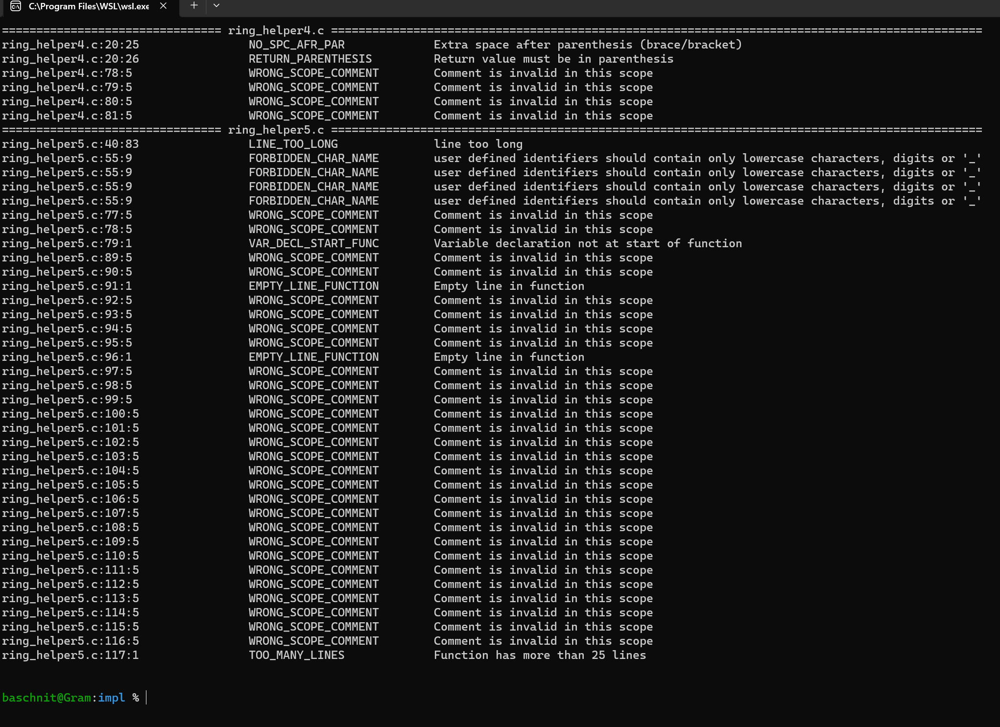
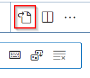

42check
=======

[42check](http://github.com/baschni/42check) is a python script which parses the output of [norminette](http://github.com/norminette) and formats it to make file links work

## Motivation

For programming I use VS Code with its integrated terminal where I launch norminette. In its output, the file name along with line and column numbers are not recognized by VS Code. 42check reformats this information: while holding `CTRL`, I can click on the filename and VS Code automatically takes me to the line of the norm error.



## Usage

Type `42check` to check the norm of all *.c and *.h files in the current directory. Type `42check specific_folder/specific_file.c` to check the norm just of that file.

## Installation

### Requirements

norminette must be installed and in the path.

### Download

Download the file [42check.py](http://github.com/baschni/42check/42check.py) and save it to a folder, e.g. `/home/<user>/programs/42check`. Goto `/home/<user>/bin`, create a  symbolic link to the downloaded file and make it executable:

```
cd /home/<user>/bin
ln -s /home/<user>/programs/42check/42check.py ./42check
chmod 0100 ./42check
```

You can now execute `42check` in your shell. If not, or if the directory `/home/<user>/bin` should not exist, see the [section below](#custom_bin).

### Put ~/bin to $PATH {user_bin}

If there is no folder `/home/<user>/bin` create it:
```
mkdir ~/bin`
```
Check if it is  in the $PATH variable:
```
echo $PATH
```
If not, you can add `export PATH=/home/<user>/bin` to your `~/.zshrc` (or `~/.bashrc` if you are using bash) or to `~/.profile`, regarding your system/needs.

### Add a shortcut for VS Code

Open the file where you can edit the keyboard shortcuts via `File -> Preferences -> Keyboard Shortcuts` and click on the file icon in the upper right corner:



Add the following code at the top. You can also modify the shortcut to your needs (here I chose `CTRL + N`):
```
{
	"key": "ctrl+n",
	"command": "workbench.action.terminal.sendSequence",
	"args": {
		"text": "cd '${fileDirname}'\n42check '${fileBasename}'\n"
	}
},
```
After pressing the shorcut, it should activate the latest open terminal, change to the directory where currently opened file resides and run `42check` on it.

If you use VS Code on Windows with WSL (Windows Subsystem for Linux), try this little hack:
```
{
	"key": "ctrl+n",
	"command": "workbench.action.terminal.sendSequence",
	"args": {
		"text": "VSCODE_WD=$(sed 's/\\\\/\\//g' <<< '${fileDirname}' | sed 's/C:/\\/mnt\\/c/g') && cd \"$VSCODE_WD\" && echo \"cd $VSCODE_WD\"\n42check \"${fileBasename}\"\n"
	}
},
```

## See also

If you like [42check](http://github.com/baschni/42check), you might also like [21norm](http://github.com/baschni/21norm), which will correct many of the norm errors detected by [norminette](http://github.com/norminette) automatically.